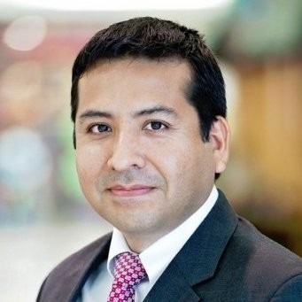
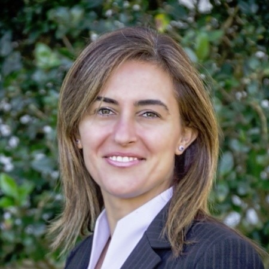
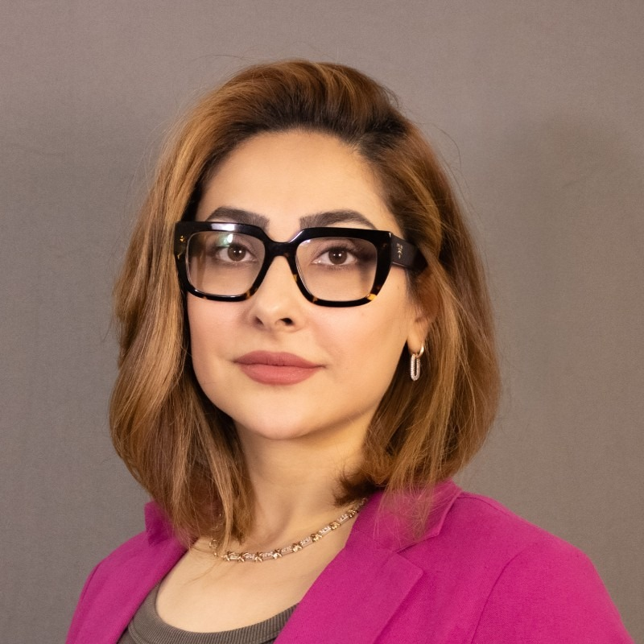

For collaboration inquiries, seminar invitations, student opportunities, and BioAI research partnerships, please contact the BioMIND team.

## General contact

::: {.bm-callout}
**Email:** *biomind\@ucf.edu* — *(placeholder; to be replaced with the approved cluster email)*

**Location:** University of Central Florida · Orlando, Florida · USA
:::

<!-- TODO(faculty-approval): Replace the general inquiry email above with the official cluster email once approved. -->

## Faculty contacts

::: {.bm-grid .bm-grid-3}

::: {.bm-person-card}
::: {.bm-person-photo}

:::
### Ivan I. Garibay
[Director, CASL]{.bm-person-role}
[Complex Adaptive Systems Laboratory]{.bm-person-affil}

For inquiries on complex systems, network science, foundation models, agentic AI, and information dynamics.

::: {.bm-person-links}
[Email](mailto:Ivan.Garibay@ucf.edu)
[Website](https://www.cs.ucf.edu/~garibay/)
[CASL](labs/casl.qmd)
:::
:::

::: {.bm-person-card}
::: {.bm-person-photo}

:::
### Ozlem Ozmen Garibay
[Director, Human-CAIR · MoML]{.bm-person-role}
[Human-Centered AI · Molecular ML]{.bm-person-affil}

For inquiries on human-centered AI, trustworthy AI, molecular machine learning, BioAI, and AI-assisted drug discovery.

::: {.bm-person-links}
[Email](mailto:ozlem@ucf.edu)
[UCF profile](https://www.cecs.ucf.edu/faculty/ozlem-ozmen-garibay/)
[Human-CAIR](labs/human-cair.qmd)
[MoML](labs/moml.qmd)
:::
:::

::: {.bm-person-card}
::: {.bm-person-photo}

:::
### Niloofar Yousefi
[Director, AI-AIR]{.bm-person-role}
[AI · Analytics · Bioinformatics]{.bm-person-affil}

For inquiries on applied AI, machine learning, bioinformatics, AI-guided drug discovery, AI-guided nanomedicine, and statistical learning theory.

::: {.bm-person-links}
[Email](mailto:niloofar.yousefi@ucf.edu)
[UCF profile](https://www.cecs.ucf.edu/faculty/niloofar-yousefi/)
[AI-AIR](labs/aiair.qmd)
:::
:::

:::

## Contact categories

::: {.bm-grid .bm-grid-2}

::: {.bm-card}
### Collaboration inquiries
Joint projects, sponsored research, or methodology partnerships across BioAI, molecular ML, complex systems, or trustworthy AI.
:::

::: {.bm-card}
### Seminar invitations
Proposals for the BioMIND seminar series or invited talks. See [Seminars](seminars/index.qmd) for the current schedule.
:::

::: {.bm-card}
### Student research opportunities
Prospective Ph.D., M.S., and undergraduate researchers should review faculty research areas and email the relevant advisor directly.
:::

::: {.bm-card}
### Website updates
Affiliated members may send updated bios, publication lists, profile links, and headshots to the website maintainers via pull request or email.
:::

::: {.bm-card}
### Media and outreach
Interviews, public talks, and science-communication requests via the general inquiry address.
:::

::: {.bm-card}
### Industry, government, nonprofit partnerships
For applied-AI partnerships across BioAI, drug discovery, AI4Science, and complex systems.
:::

:::

::: {.bm-callout .bm-callout-gold}
**Note.** The cluster-level inquiry email is a placeholder pending official provisioning. Faculty email addresses above are accurate.
:::
