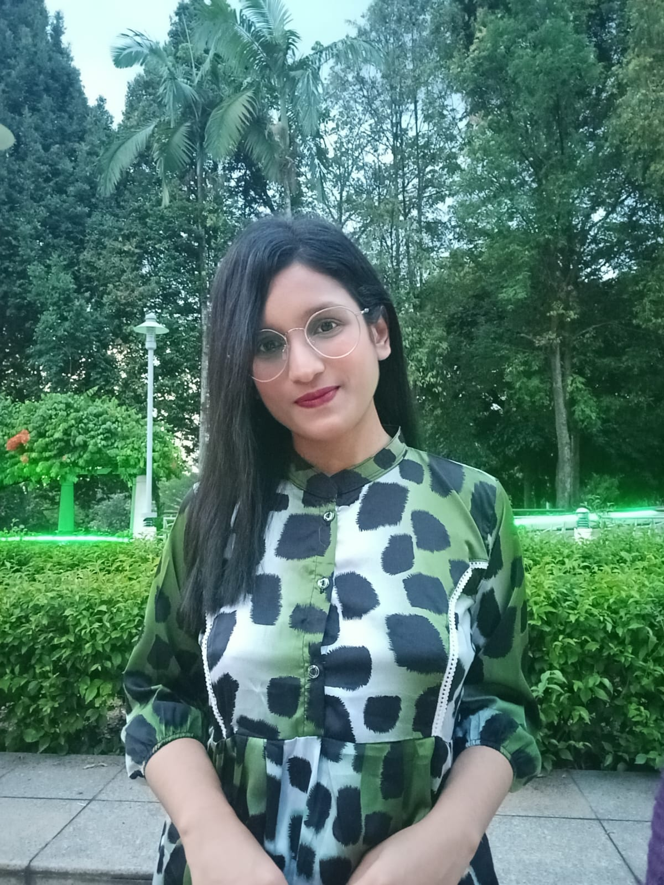
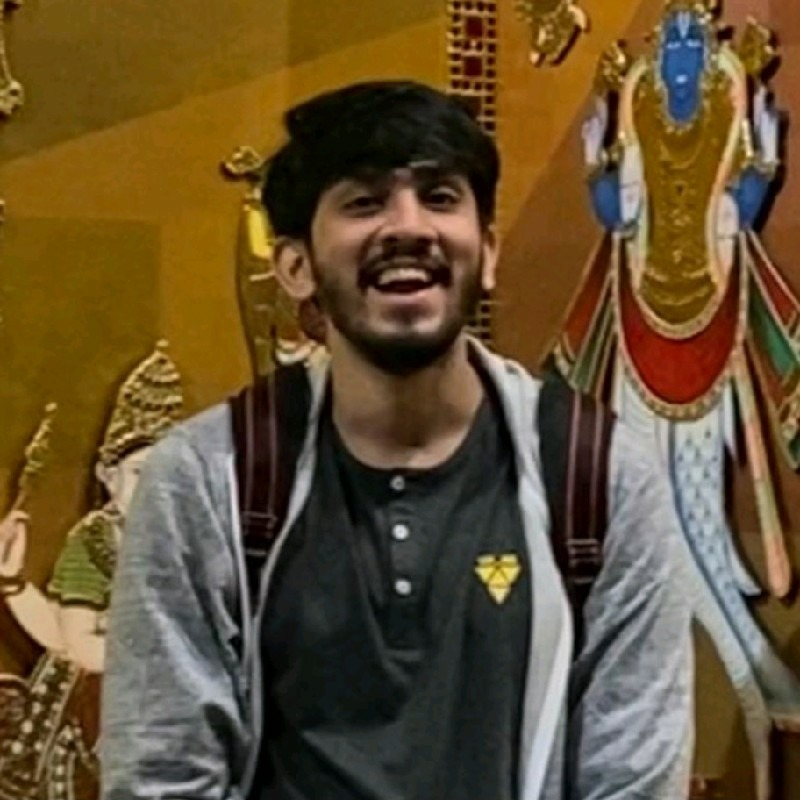
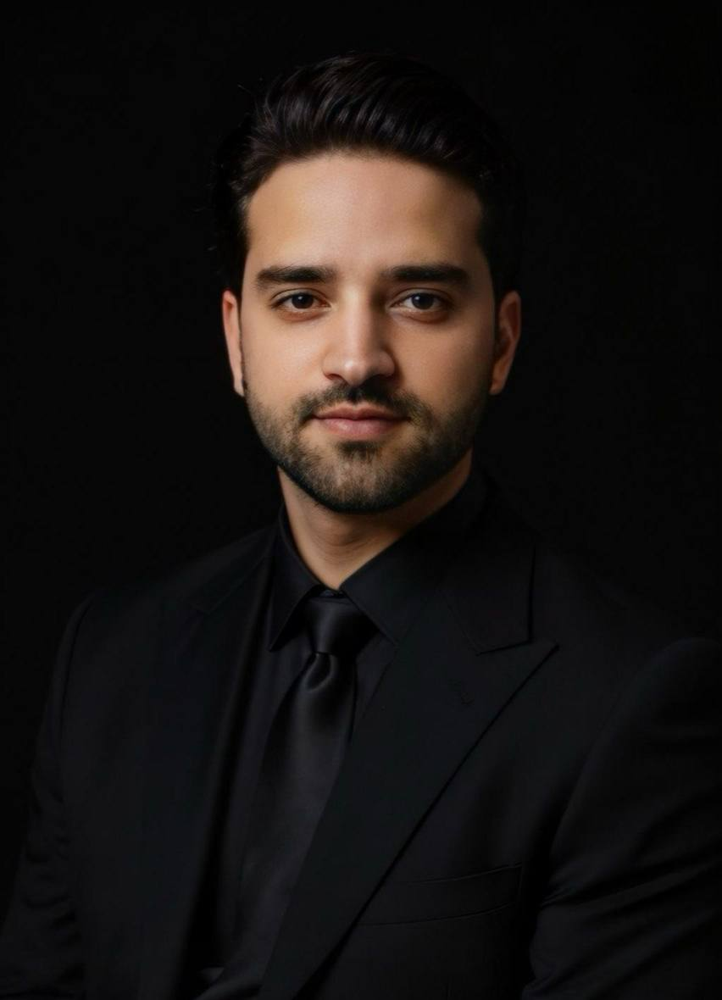
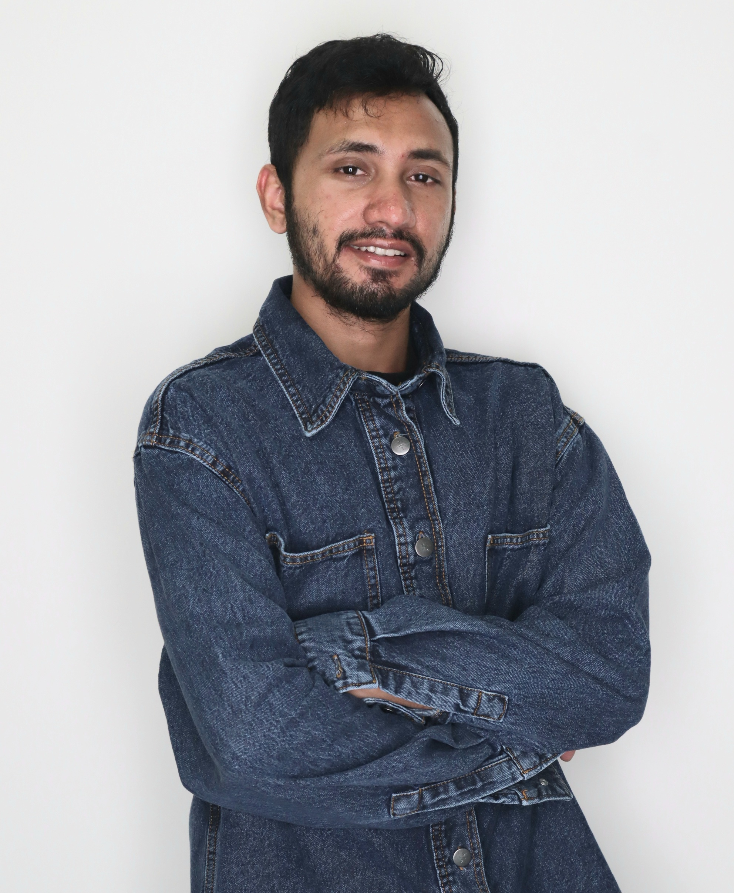

BioMIND brings together faculty, graduate students, undergraduates, alumni, and collaborators at UCF and beyond. Browse by category, or jump to the [Faculty](faculty.qmd), [Students](students.qmd), [Alumni](alumni.qmd), and [Collaborators](../collaborators/index.qmd) pages directly.

## Faculty

::: {.bm-grid .bm-grid-3}

::: {.bm-person-card}
::: {.bm-person-photo}

:::
### Ivan I. Garibay
[Professor · IEMS · UCF]{.bm-person-role}
[Director, CASL]{.bm-person-affil}

Complex adaptive systems, network science, foundation models, agentic AI, and information dynamics.

::: {.bm-person-links}
[Profile](faculty.qmd#ivan-i-garibay)
[Lab](../labs/casl.qmd)
:::
:::

::: {.bm-person-card}
::: {.bm-person-photo}

:::
### Ozlem Ozmen Garibay
[Assistant Professor · IEMS · UCF]{.bm-person-role}
[Director, Human-CAIR · MoML]{.bm-person-affil}

Human-centered AI, responsible AI, explainability, molecular machine learning, and AI-assisted drug discovery.

::: {.bm-person-links}
[Profile](faculty.qmd#ozlem-ozmen-garibay)
[Human-CAIR](../labs/human-cair.qmd)
[MoML](../labs/moml.qmd)
:::
:::

::: {.bm-person-card}
::: {.bm-person-photo}

:::
### Niloofar Yousefi
[Assistant Professor · IEMS · UCF]{.bm-person-role}
[Director, AI-AIR]{.bm-person-affil}

Applied AI, machine learning, bioinformatics, AI-guided drug discovery, generative AI for science, and statistical learning theory.

::: {.bm-person-links}
[Profile](faculty.qmd#niloofar-yousefi)
[Lab](../labs/aiair.qmd)
:::
:::

:::

[See all faculty →](faculty.qmd){.bm-btn .bm-btn-primary}

## Ph.D. Students

::: {.bm-grid .bm-grid-4}

::: {.bm-person-card}
::: {.bm-person-photo}

:::
### Tasfia Nuzhat
[Ph.D. · Industrial Engineering]{.bm-person-role}
[Advisor: Dr. Niloofar Yousefi]{.bm-person-affil}

Generative AI, large language models, bioinformatics, molecular generation, diffusion models, biomedical NLP.
:::

::: {.bm-person-card}
::: {.bm-person-photo}

:::
### Siddhi Kanta Mishra
[Ph.D. · IEMS · GRA, CASL]{.bm-person-role}
[Advisor: Dr. Ivan Garibay]{.bm-person-affil}

Graph limits, AI explainability, information flow in neural networks, network science, diffusion models, molecular representation.
:::

::: {.bm-person-card}
::: {.bm-person-photo}

:::
### Mehrdad Shoeibi
[Ph.D. · Industrial Engineering]{.bm-person-role}
[Advisor: Dr. Niloofar Yousefi]{.bm-person-affil}

BioAI, machine learning, generative AI, foundation models for gene regulation, reliable AI, healthcare AI.
:::

::: {.bm-person-card}
::: {.bm-person-photo}

:::
### Elias Hossain
[Ph.D. · Industrial Engineering]{.bm-person-role}
[Advisor: Dr. Niloofar Yousefi]{.bm-person-affil}

Trustworthy AI, uncertainty quantification in LLMs, preference optimization, reinforcement learning, agentic AI.
:::

:::

[See all students →](students.qmd){.bm-btn .bm-btn-primary}

## Other directories

::: {.bm-grid .bm-grid-2}

::: {.bm-card}

[🌟]{.bm-card-icon}

### Alumni

Former members now in academia, industry, and government.

[View alumni →](alumni.qmd){.bm-card-link}
:::

::: {.bm-card}

[🤝]{.bm-card-icon}

### Collaborators

Partners across UCF, other universities, industry, government, and nonprofits.

[View collaborators →](../collaborators/index.qmd){.bm-card-link}
:::

:::

::: {.bm-callout .bm-callout-gold}
**Profile collection in progress.** Additional student, alumni, and collaborator profiles are being collected. If you are a BioMIND member, please see the [README](https://github.com/biomind-eng/biomind) for the content checklist and submit your materials to the cluster coordinator.
:::
